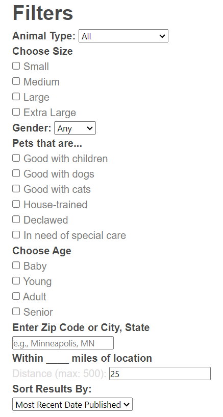
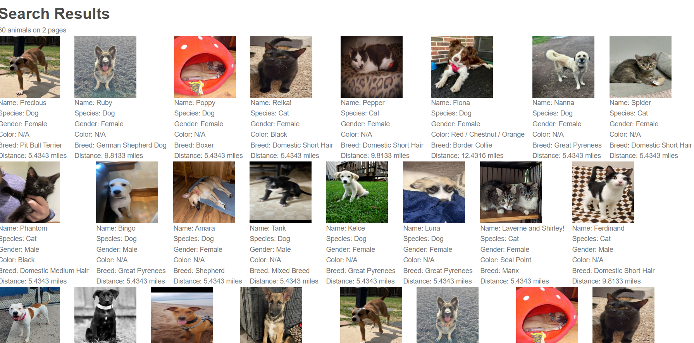
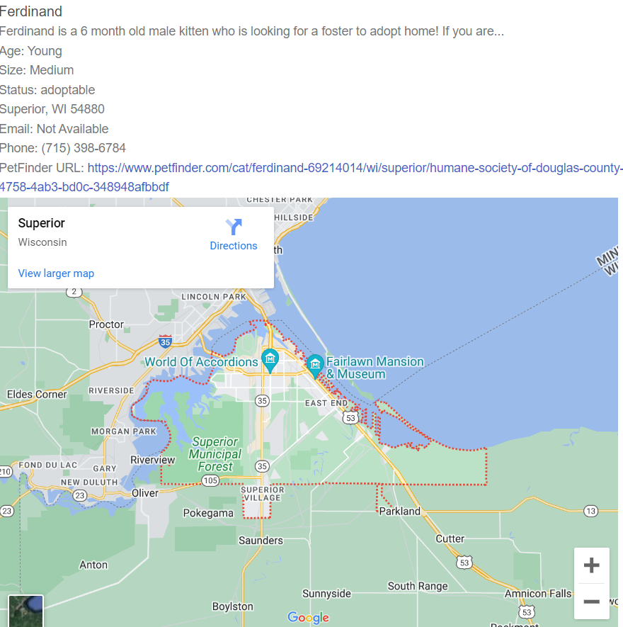

# The Pet Seeker

## Table of Contents
* [What is the Pet Seeker](#what-is-the-Pet-Seeker)
* [Installation](#Installation)
* [How to Use the Pet Seeker](#how-to-use-the-Pet-Seeker)
* [Credits](#Credits)
* [License](#license)

### What is the Pet Seeker

The Pet Seeker is an interactive pet adoption locator app designed for pet lovers, by pet lovers! The Pet Seeker allows you to fill out a form with the ideal pal you have in mind, and shows you who is nearby looking for a new loving family. Whether you are a dog person, a cat person, or a lover of animals of all kinds, the Pet Seeker has you covered.

### Installation

The Pet Seeker functions on your web browser. No additional bells and whistles required!

### How to Use the Pet Seeker
To use the Pet Seeker, select Adopt from the navigation menu on the home page. Alternatively, if you scroll down the page clicking the "Start" button will bring you to the adoption search form. Select the attributes that describe the furry friend you are seeking, and enter your location information. When you click search, you will find somebody special near you that's looking for a loving furever home!

Click which pet you would like to view, and scroll to the bottom of the page. Here you will find extended details for your chosen pet, and their location in Google Maps.

 Did you accidentally close the page? Not to worry - simply come back to our search form and your recently browsed pets and their adoption information have been stored locally for you to revisit.

### Credits

Coded by Jared Bartos, Rob Tatro, Katie Scheffler, Carlos Pena, and Nick Radtke

Application is powered by Petfinder's API, along with Google Maps API.

### License

Please refer to the license in the petSeeker repo.
